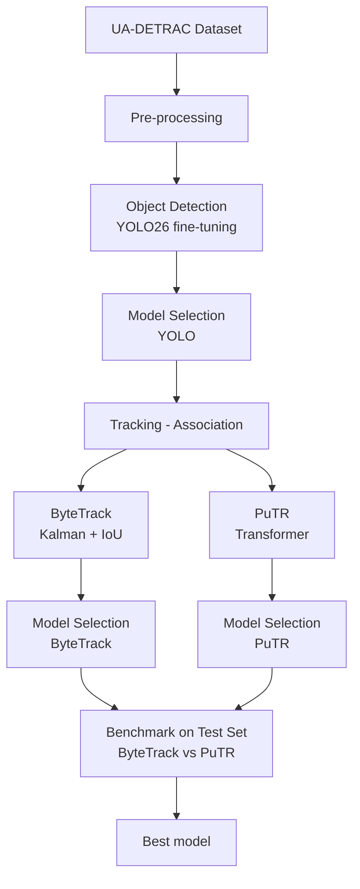
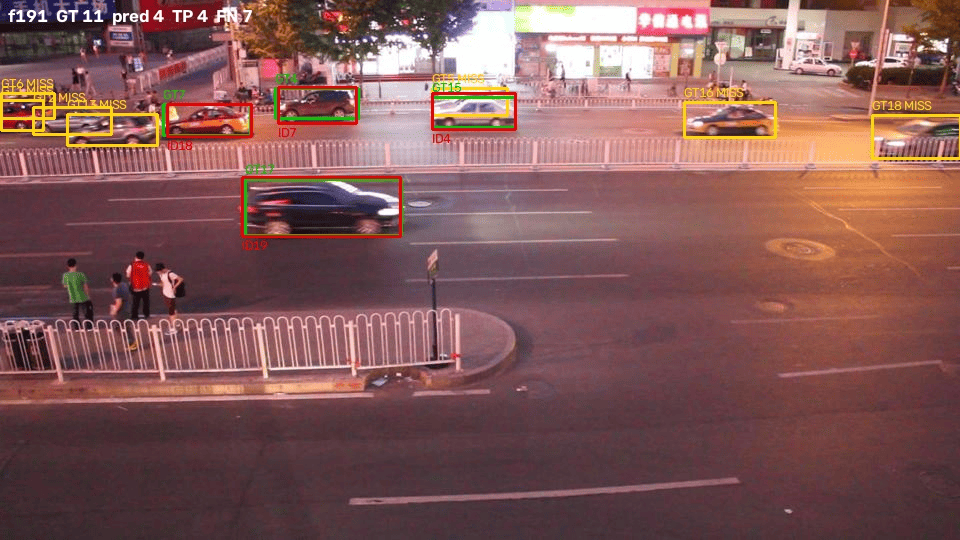

# TrackDetrac

Project for the **Computer Vision** course, MSc in Computer Science, Department of Mathematics and Computer Science, University of Catania (A.Y. 2025/2026).

**Authors:** Edoardo Tantari, Raffaele Terracino <br>
**Supervisors:** Prof. Sebastiano Battiato, Prof. Francesco Guarnera


## Project Description

This project compares, **with the detector held fixed**, two families of association modules under the *tracking by detection* paradigm on [UA-DETRAC](https://detrac-db.rit.albany.edu/) [3] data:

- **ByteTrack** [1]: an explicit, non-learned association based on a linear-motion Kalman filter, IoU cost and the Hungarian algorithm, with its characteristic two-threshold matching (low-confidence detections are recovered in a second association round).
- **PuTR** [2]: association learned by a transformer that operates on box coordinates rather than pixels. Boxes from the most recent frames are treated as a sequence of tokens; causal attention produces context-aware features whose similarity replaces the fixed IoU formula. **PuTR is forked and modified to make it suitable for DETRAC**.

Both methods receive exactly the same detections, produced by a **YOLO26-m** [5] model finetuned on UA-DETRAC.

## Tech stack 
- [**Ultralytics**](https://docs.ultralytics.com/it)
- [**Fork of PuTR**](https://github.com/weiss25r/PuTR) 
- [**TrackEval**](https://github.com/JonathonLuiten/TrackEval) [4]
- **OpenCV**


## Pipeline
The following diagram illustates the full project pipeline:

For a detailed description of every step refer to [project report](docs/report.pdf)
## Technical Reproducibility
### Data Setup
UA-DETRAC](https://detrac-db.rit.albany.edu/) [3] is a collection of 100 sequences captured from fixed overhead cameras on footbridges in Beijing and Tianjin, with over 140,000 frames at 25 fps, 960x540 resolution, roughly 1.21M annotated boxes over 8,250 distinct vehicles. You can download data on [Kaggle](https://www.kaggle.com/datasets/bratjay/ua-detrac-orig). 
Preprocessing is required to use DETRAC with YOLO, ByteTrack, PuTR and TrackEval. Three conversation scripts are used for this goal: ```detrac_to_yolo.py```, which also performs training/val split and sampling, ```detrac_to_putr.py``` and ```detrac_to_mot.py``` for TrackEval evaluation.
### Training and evaluation
Training of YOLO detector is performed inside notebook ``` training_template.ipynb```, instead, evaluation of bytetrack is perfomed by the script ```tracking_inference.py ```. All PuTR operations (training and evaluation) and the TrackEval evaluations are perfomed by the scripts of the  [related repositories](#tech-stack). Config files for model selection are available in ```experiments/configs```.


## Results

### Final benchmark on the test set

| Method | HOTA | DetA | AssA | MOTA | MOTP | IDF1 | IDSW | Frag | MT | ML |
|---|---:|---:|---:|---:|---:|---:|---:|---:|---:|---:|
| ByteTrack | 67.213 | 63.308 | 71.684 | 70.882 | 86.354 | 78.540 | 1005 | 2702 | 1494 | **131** |
| **PuTR** | **70.795** | **65.462** | **76.838** | **73.684** | **87.942** | **82.644** | **339** | **2283** | **1570** | 166 |

PuTR outperforms ByteTrack by roughly 3 HOTA points and cuts identity switches by 66.3%. The widest gap is on AssA (+5 points), consistent with the IDSW counts: the associations produced by the transformer are far more stable over time. The only metric where ByteTrack comes out ahead is ML.

### Qualitative results
The following gif demonstrates PUTR capabilities on a sample 4-frame clip, showing ground truth, predictions and misses. <br>



## References

[1] Y. Zhang et al., *ByteTrack: Multi-Object Tracking by Associating Every Detection Box*, 2022. <br>
[2] C. Liu, H. Li, Z. Wang, R. Xu, *Is a Pure Transformer Effective for Separated and Online Multi-Object Tracking?*, 2025. <br>
[3] L. Wen et al., *UA-DETRAC: A New Benchmark and Protocol for Multi-Object Detection and Tracking*, 2020. <br>
[4] J. Luiten, A. Hoffhues, *TrackEval*, https://github.com/JonathonLuiten/TrackEval, 2020. <br>
[5] G. Jocher et al., *Ultralytics YOLO26: Unified Real-Time End-to-End Vision Models*, 2026.